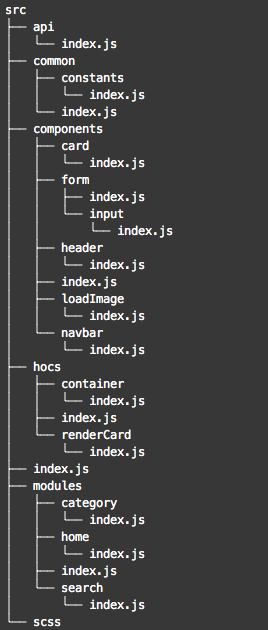

# Create our base project

Now lets create our project and configure our folder structure.

```bash
yarn create react-app news-feed
```

## Packages

Now lets install the following libraries:

#### axios

#### moment

#### node-sass

#### nprogress

#### react-lazyload

#### react-router-dom

```bash
yarn add axios moment node-sass nprogress react-lazyload react-router-dom
```

## File Structure

Then remember in the **root of the folder app** configure the `jsconfig.json` file; also add a file called `.env` when we gonna create our environment variables.



```javascript
{
  "compilerOptions": {
    "baseUrl": "src",
    "paths": {
      "*": ["src/*"]
    }
  },
  "include": ["src/*"]
}
```



```
# Empty by default
```



Then in addition, to the basic file structure we use in the last workshop, lets gonna create 3 folders more

#### api

To set up out api configuration, and only from that package we are going to use axios to call our API or API's

#### hocs

Where we gonna create our HOC's components



As you can see, I create the folders for each **component** that we gonna create now, and in **`common`** folder, I create another one called **`constants`**, that folder will be useful later.


To avoid create those files manually, download the src folder here and copy it to your project.





I also add **`scss`** folder with all styles already written, so in the process we are going to use the classnames already.


Now if you run your app with

```bash
yarn start
```

You should only see white page with only a text that says **News Feed App** 

